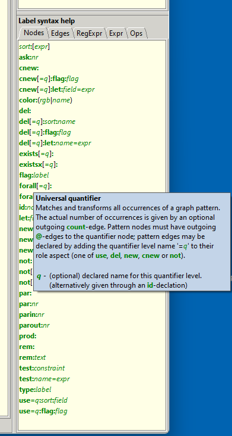
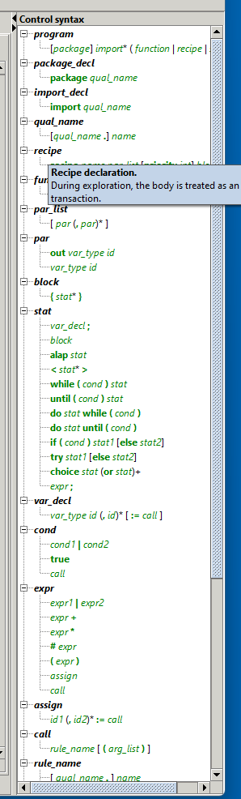

This is the web edition of the GROOVE user manual, which supersedes the legacy PDF manual. All chapters have been rewritten against the current feature set of the tool; the status column below records the tool version against which each chapter was last checked.

## Chapters

| Chapter | Contents | Checked against |
| :--- | :--- | :--- |
| [Introduction](manual_introduction.html) | What GROOVE is, the concepts behind it, and the components of the tool set | 8.0.0 |
| [Graphs and rules](manual_basics.html) | Editing host graphs and transformation rules | 8.0.0 |
| [Advanced rule features](manual_advanced.html) | Wildcards, regular expressions, attributes, parameters, quantification, typing and system properties | 8.0.0 |
| [Control language](manual_control.html) | Programming the order of rule applications | 8.0.0 |
| [Exploration and verification](manual_verification.html) | Configuring exploration, and model checking | 8.0.0 |
| [Import and export](manual_io.html) | Storage formats, and exchanging graphs and grammars with other tools | 8.0.0 |

## Reference pages

In addition to the chapters, the manual contains reference pages that are *generated from the GROOVE source code*, so they cannot drift out of date:

- [Aspect prefixes](manual_ref_prefixes.html) — the complete label syntax for host graphs, rules and type graphs
- [Data operations](manual_ref_operators.html) — all built-in operations on the data sorts
- [Control grammar](manual_ref_control.html) — the full grammar of the control language
- [Exploration keys](manual_ref_exploration.html) — the keys and values of the exploration configuration, and the legacy `-s`/`-a` options

## Help within the tool

Further help is available within the Simulator tool: when editing graphs or control programs, the right-hand side panel displays a range of options. Hovering on the options gives you further information about how to use them. Here are two example screenshots:

| Graph editor prefixes | Control language grammar |
|    :-------------------:     |  :---:  |
| &emsp;  &emsp; | &emsp;  &emsp; |
