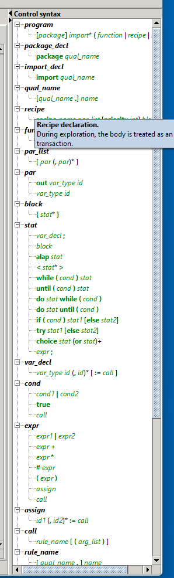

{{site.data.defs.groove_url}}/usermanual/blob/master

- 

The user manual currently consists of two pdf documents, unfortunately both quite outdated with respect to the current feature set:

- [Full user manual]({{usermanual_url}}/usermanual.pdf)
- [Quick reference chart]({{usermanual_url}}/quick-reference.pdf)

Further help is available within the Simulator tool: when editing graphs or control programs, the right-hand side panel displays a range of options. Hovering on the options gives you further information about how to use them. Here are two example screenshots:

| Graph editor prefixes | Control language grammar |
|    :-------------------:     |  :---:  |
| &emsp;  &emsp; | &emsp;  &emsp; |
